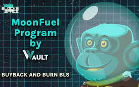
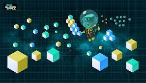

---
title: "1000Blocks Space"
description: "由社区驱动的 NFT，每天都会产生奖励。"
date: 2022-08-02T00:00:00+08:00
lastmod: 2022-08-02T00:00:00+08:00
draft: false
authors: ["crazyxuanshao"]
featuredImage: "1000blocks-space.png"
tags: ["NFT Games","1000Blocks Space"]
categories: ["nfts"]
nfts: ["NFT Games"]
blockchain: "BSC"
website: "https://dappradar.com/deeplink/9153"
twitter: "https://twitter.com/1000Blocks"
discord: "https://discord.com/invite/cqvX2ZRvNK"
telegram: "https://t.me/thousandblocks"
github: ""
youtube: "https://www.youtube.com/channel/UCa0SbrRAAd6re9QKfQ9sKCw"
twitch: ""
facebook: "https://www.facebook.com/1000blocks.space"
instagram: "https://1000blocks.space/img/Social-1000Blocks-Instagram.34da92a0.png"
reddit: "https://www.reddit.com/r/1000Blocks/"
medium: ""
steam: ""
gitbook: ""
googleplay: ""
appstore: ""
status: "Live"
weight: 
lightgallery: true
toc: true
pinned: false
recommend: false
recommend1: false
---

<strong>1000Blocks.space 是关于</strong>社区支持的 NFT。您可以投资街区区域，在其中放置您想向世界展示的海报/图像。只要你是一个区块的所有者（没有人掩盖你），你就可以不断地获得他们的 BLS 代币。

在整个 Blocks Space 被海报/图像覆盖并达到预设的时间限制后，就会铸造 NFT（想象 Beeple Everyday 或未来的按需 NFT 用例）。然后，该 NFT 在公开市场上拍卖，利润与区块区域的所有投资一起进入奖励池。

BLS 持有者可以将他们的代币存入 Blocks Vault，从奖励池中赚取 BNB 收益。

这只是基本功能，但平台提供了更多功能。阅读有关媒介的完整概念文章并找到您的制胜策略。

总之，您可以投资产生 BLS 代币收益的视觉房地产，也可以作为一件艺术品，您可以质押这些 BLS 代币以分享各种收入流，包括该艺术品的利润。 

