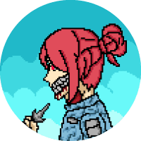

1111 left-side pfp NFTs living on the Tezos 

> 一个独特的头像，可在任何地方使用以在 Tezos 区块链上脱颖而出。

> 成为 101PXL 收藏家。安全地购买、出售和交易。并在每次发布新版本时获得独家 NFT。

> 在所有 1111 售出后，我们运行 Version 2 将它们变成 3D。150 位幸运业主将免费获得。

> 成为 Tezos 生态系统新 NFT 社区的一员

101PXL NFT 上有 4 个物种。

#### 人类

人类必须在统治世界的僵尸和怪物的威胁中生存。

#### 僵尸

主要敌人是具有高生存能力的人类和半机械人。

#### 电子人

创建电子人是为了帮助人类保护人口免于灭绝

#### 怪物

怪物是进化的僵尸，具有更高的速度、智力和生存能力。