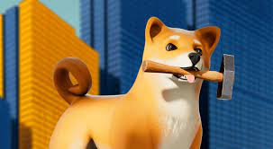
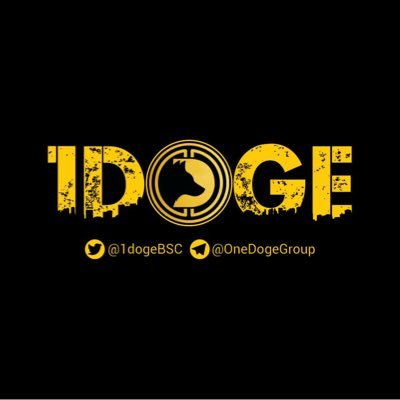

1Doge 的灵感来自 Pokemon Story，我们的使命是建立一个由数字宠物和怪物组成的生态系统，使数十亿人能够以简单、富有创意和令人愉快的方式参与基于 NFT 和区块链的游戏世界。 任何人都可以通过熟练的游戏玩法和对生态系统的贡献来赚取代币。 玩家可以为他们的宠物战斗、收集、饲养和建造一个陆地王国。

**一狗之地**

1Doge 的土地发生在一个充满魔法的幻想世界中，在被来自另一个星球的饥饿怪物入侵之前，这里曾经很平静，这些怪物以其他生物的大脑为食以获取力量和补充能量。 半数以上的生物都被他们杀死了。

宇宙中剩余的物种已经开始集结，组建军队，对抗入侵者； 并为最大的生死战做准备。!

