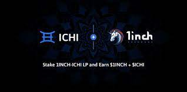

​				

**一旦你的桶读满，矿工将继续开采。 24 小时计时器只是为了您的方便。**

1. 矿工不是被买来的，矿工是被雇佣的，因此他们不能被卖掉。一旦矿工被雇用，他们就会无限期地为您工作，以每天 3% 的起始费率为您提供无限量的 1 英寸。

2. 用户个人承担的唯一费用是他们的交易 Gas 费，由 BSC 网络收取。
   无论您何时雇用矿工，您都将从每天 3% 的回报率开始。

3. 我们建议您每天至少复利一次，但您可以随意进行多次。

   

4.  1InchMiner 由持续的社区支持维持，就像所有其他加密货币、代币或项目一样。不同之处在于 1InchMiner 还有一种算法，不允许其他人立即将他们的代币倾销到社区中。
   您可以使用带有 dapp 浏览器的应用程序并选择 Metamask/Injected 选项，或者只需使用您想要的任何浏览器并选择 WalletConnect 以连接到手机上的钱包应用程序。
   按照设计，从长远来看，复利将比套利更有利可图。

5. 一旦您的钱包通过 SmartChain (BSC) 网络连接到 1InchMiner 网站，您会注意到您的推荐地址出现在页面底部。当新用户在点击您的个人推荐链接后雇用矿工时，合约将立即向您的桶发送 1 英寸等于 10% 的价值。聪明点，用它来雇佣矿工并为自己建立收入来源。

