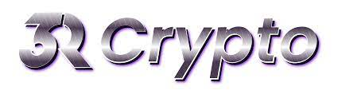
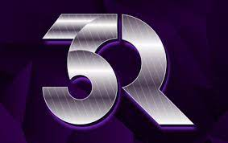

**"R"estake "R"eflections "R"ebuy Auto Fire Pit**

我们最高的固定 APY 为 385,945.80%。它是从 2.02% 的每日投资回报率（每日投资回报率）产生的。每 30 分钟（每天 48 次）获得奖励，在您的钱包中自动进行质押和复利！当奖励自动分配时，利息每 30 分钟定期复利。

8% 的购买费用和 9% 的销售费用用于“反射”，它为持有者提供被动 BUSD 奖励给任何购买/出售的人。&nbsp;计算：当日交易量为 100 万，您将获得 100 万美元的 8/9% = 80/90k x 总持有人股份的百分比。

所有购买和购买的 3%所有销售额的 4% 进入“重新购买”（Treasury）钱包。这将定期进行，以维持任何大规模抛售或建立购买压力。它还将战略性地用于 CMC/CG 或任何即将上市的任何 CEX/DEX，以提振我们的最大赢家。

所有交易的 2% 在 Auto Fire Pit 中被烧毁。交易越多，投入火中的越多，导致火坑通过自我实现的自动组合越来越大，减少循环供应并保持火坑稳定。

