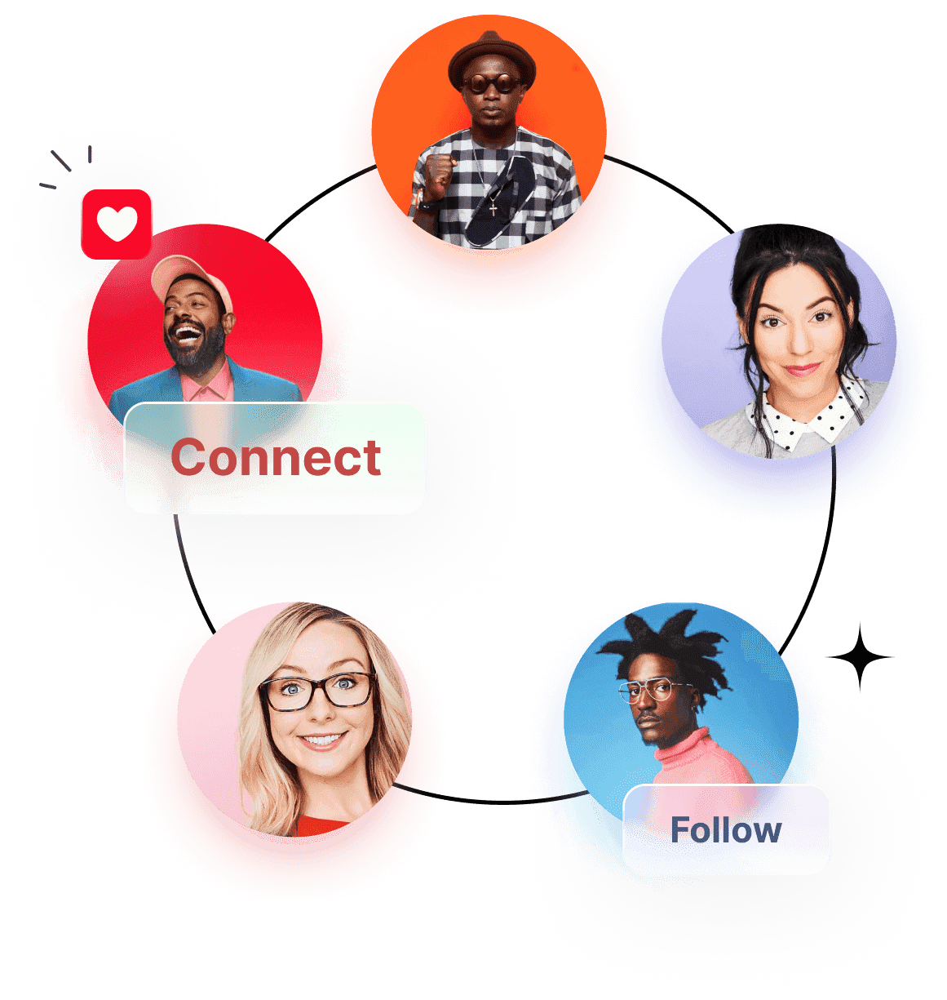

5Degrees 是一个去中心化社交网络协议，帮助人们轻松进入 Web3.0。

Web2.0

每个应用的社交网络都需要重新建立。

Web3.0

用户社交网络建立后，后续所有DApp都可以根据链上数据自动关联。

**Web3 社交桥梁**

我们相信是时候进行一场革命了。

5Degrees 是通往新开放互联网的门户，旨在将 Web 2.0 用户连接到 Web 3.0

拥有你的数据，在Web3.0认识你的朋友

现在，控制自己的资产

# **5Degrees 协议与当前社交网络的区别**？

Web2.0社交网络都是从其中心化数据库中读取数据，缺乏可移植性和可控性。您的个人资料和社交关系将存储在特定网络中并归运营商所有。这可能导致零和博弈，不同的公司不得不为用户的数据而战，而不是为良好的用户体验而战。然而，Web3.0 的核心使命是将数据所有权还给 Web2.0 用户，这是 5Degrees 致力于做的事情，让用户能够掌控自己的社交数据。

