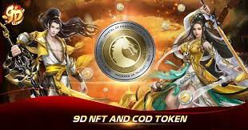

---
title: "9D NFT"
description: "东南亚首个基于币安智能链（BSC）的3D武术/元界NFT游戏已准备好加入该领域。"
date: 2022-08-01T00:00:00+08:00
lastmod: 2022-08-01T00:00:00+08:00
draft: false
authors: ["crazyxuanshao"]
featuredImage: "9d-nft.png"
tags: ["NFT Games","9D NFT"]
categories: ["nfts"]
nfts: ["NFT Games"]
blockchain: "BSC"
website: "https://9dnft.com/"
twitter: "https://mobile.twitter.com/9dnft"
discord: ""
telegram: "https://t.me/Official_9DNFT"
github: "https://github.com/topics/nft-game"
youtube: ""
twitch: ""
facebook: "https://www.facebook.com/9DNFT/"
instagram: "https://www.instagram.com/9tales.nft/"
reddit: ""
medium: "https://medium.com/@9dnft"
steam: ""
gitbook: ""
googleplay: ""
appstore: "https://apps.apple.com/us/app/9dnft-mobile/id1592241683"
status: "Live"
weight: 
lightgallery: true
toc: true
pinned: false
recommend: false
recommend1: false

---

## 东南亚首个基于币安智能链（BCS）构建的 3D 武术/元界 NFT 游戏已准备好加入该领域。

9D NFT 是一款利用区块链和区块链的 MMO 武术游戏。 NFT技术。游戏有一个受亚洲文化影响的东方大陆主题——“东方平原”。它是东南亚第一款 3D 武术/元界 NFT 游戏。这款基于武术的 MMO 游戏允许人们在我们创建的虚拟世界中相互互动。加入 9D NFT 的玩家需要从 9D NFT 设计的基于五行系统（刀法师、弓法师、琴师、法杖师和剑术师）的五个派系中选择一个角色作为主角加入冒险3D 世界中的“龙”探索新大陆。在此过程中，玩家可以领取可以在 Marketplace 上交易的 NFT 物品。 9D NFT已于2021年12月29日正式上线，每日有可信玩家号加入。 COGI 是 9D NFT 项目的治理代币。 COGI 是 Crypto Online Gaming Infrastructure 的缩写，它也传达了该项目创建专门为在线游戏构建的加密货币平台的愿景。

