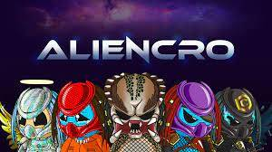

AlienCro NFT 掉落向您介绍了我们宇宙的神秘和未发现的外部末端。 亲身体验 1061 个独特的外星人之一，并成为星际加密探索的一部分。
我们自己的设计师一共创造了 7 个特质，每个外星人都有 100% 独特的这些特质组合。 合并您的 NFT 的背景、西装、头盔、武器、眼睛、皮肤和发型，使其与您自己一样个性。
所以系好安全带，打开涡轮机，准备好疯狂骑行吧！

AlienCRO genesis NFT drop由总共1060个独特的NFT组成，具有手绘特征。从集合中持有NFT将授予对堆叠池的访问权限，但也允许访问随机NFT空投。您可以期望从质押池中获得本地CRO奖励，而NFT将来自流行的Cronos项目！其中一个突出的特点是通过持有NFT来赢得未来的cro反思。社区是该项目的命脉，将参与各种决策以确保长寿。

