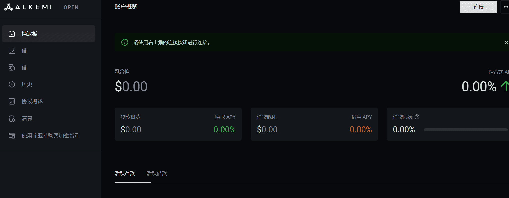

Alkemi Network 为机构和交易所提供数字资产市场的交钥匙接入。 我们为客户提供参与去中心化金融生态系统中合规环境所需的工具。
Alkemi Network 正在将 CeFi 连接到 DeFi，建立一个分散的流动性网络，其中包含一套工具和产品，作为每个人参与 DeFi 的入口。

## 关于Alkemi Earn

Alkemi Earn 是一个去中心化借贷平台，可让您通过在以太坊区块链上构建的流动资金池中查找您的加密资产来获得利息并赚取被动收入。 智能合约使整个过程自动化，这意味着您无需自己管理贷款即可赚取 APY。