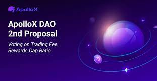

---
title: "ApolloX"
description: "全球首个 CEX-DEX 混合加密货币交易所."
date: 2022-08-03T00:00:00+08:00
lastmod: 2022-08-03T00:00:00+08:00
draft: false
authors: ["crazyxuanshao"]
featuredImage: "apollox.png"
tags: ["DeFi","ApolloX"]
categories: ["nfts"]
nfts: ["DeFi"]
blockchain: ""
website: "https://www.apollox.finance/en"
twitter: "https://twitter.com/ApolloX_com"
discord: "https://discord.com/invite/q5eH3zktcm"
telegram: "https://t.me/apolloxchange"
github: ""
youtube: ""
twitch: ""
facebook: "https://www.facebook.com/ApolloXcom/"
instagram: "https://www.instagram.com/accounts/login/?next=/apollox_com/"
reddit: "https://www.reddit.com/r/ApolloX_com/"
medium: ""
steam: ""
gitbook: ""
googleplay: ""
appstore: ""
status: "Live"
weight: 
lightgallery: true
toc: true
pinned: false
recommend: false
recommend1: false
---

ApolloX 是世界上第一个 CEX-DEX 混合加密货币交易所。 ApolloX 于 2021 年推出，其使命是让所有人都能使用加密货币，而不仅仅是专业交易者。 在 ApolloX 上，用户可以交易多种永续期货和现货交易对。 2022 年，ApolloX 宣布了向 DAO 治理模式过渡的计划。

ApolloX 生态系统正在快速发展，拥有中心化和去中心化的交易所、DeFi 钱包、ApolloX NFT、加密教育频道等。 APX 是 ApolloX 的实用治理代币，可以作为 ApolloX 上的交易奖励获得。
欲了解更多信息，请访问 ApolloX DEX：www.apollox.finance 和 ApolloX CEX：www.apollox.com。

.png)

