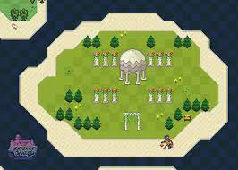
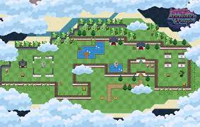

---
title: "Apprentice Of Magic"
description: "免费畅玩｜尽享乐趣｜所有 NFT 资产全部上线 Polygon Chain."
date: 2022-08-03T00:00:00+08:00
lastmod: 2022-08-03T00:00:00+08:00
draft: false
authors: ["crazyxuanshao"]
featuredImage: "apprentice-of-magic.png"
tags: ["NFT Games","Apprentice Of Magic"]
categories: ["nfts"]
nfts: ["NFT Games"]
blockchain: "Polygon"
website: "https://aomgame.com/#/?utm_source=DappRadar&utm_medium=deeplink&utm_campaign=visit-website"
twitter: ""
discord: "https://discord.com/invite/nhQQvTDJ7E"
telegram: ""
github: ""
youtube: "https://www.youtube.com/channel/UCFuDKZmwITqNoPYkjayqXDw/featured"
twitch: "https://twitter.com/AOM_Zyolo"
facebook: ""
instagram: ""
reddit: ""
medium: "https://medium.com/@AOM_Zyolo"
steam: ""
gitbook: ""
googleplay: ""
appstore: ""
status: "Live"
weight: 
lightgallery: true
toc: true
pinned: false
recommend: false
recommend1: false
---

魔术学徒是基于区块链技术的下一代和开放世界的游戏，它连接了传统和现代游戏风格。

它包含种植，冒险，铸造，社区等。玩家可以与我们的团队一起参与并设计游戏，以确定AOM的未来。

每个战利品都是一种NFT资产，可以当P2E被广泛过度使用时，作为游戏在玩游戏时获得，也可以在市场.上自玩家，我们将致力于打造一款有趣的由交易。当然，如果您有幸获得了稀游戏。否则，炒作过度后，将一无所有的NFT,您将获得更多的奖励。

因此，我们将更加关注游戏开发的质量和进度，玩家将控制自己的数字资产和市场价格。

尽管3D在游戏演示中占据主导地我们使用Web3和Unity技术构建在位，但像素艺术仍然存在，尤其是在区块链上运行的MMORPG游戏。我游戏机、独立游戏和CryptoPunks等们的团队与合作伙伴进行了深入的沟数字收藏中。通和交流，共同打造一流的区块链产品。

