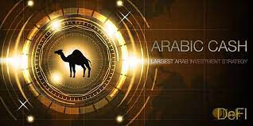

---
title: "Arabic.cash"
description: "阿拉伯加密行业的增长速度超过了当地的摩天大楼。 最引人注目的加密谷项目之一是阿拉伯现金。"
date: 2022-08-03T00:00:00+08:00
lastmod: 2022-08-03T00:00:00+08:00
draft: false
authors: ["crazyxuanshao"]
featuredImage: "arabic-cash.png"
tags: ["DeFi","Arabic.cash"]
categories: ["nfts"]
nfts: ["DeFi"]
blockchain: "BSC"
website: "https://arabic.cash/?utm_source=DappRadar&utm_medium=deeplink&utm_campaign=visit-website"
twitter: "https://twitter.com/arabic_cash"
discord: ""
telegram: "https://t.me/ArabicCashBot"
github: "https://github.com/arabicscash"
youtube: "https://www.youtube.com/channel/UCbhbsveLKrkp0Q1zrUpkHGA"
twitch: ""
facebook: ""
instagram: ""
reddit: ""
medium: "https://arabics-cash.medium.com/"
steam: ""
gitbook: ""
googleplay: ""
appstore: ""
status: "Live"
weight: 
lightgallery: true
toc: true
pinned: false
recommend: false
recommend1: false
---

2018 年，当阿拉伯金融科技项目的投资额超过 3.2 亿美元时，Sheikh Mohammed bin Rashid 决定将阿拉伯联合酋长国完全数字化。 他宣布启动“2021 年区块链战略”，旨在使阿联酋成为数字化领域的全球领导者。 酋长声称，仅今年一年，该国在文书工作上的花费就可以为政府节省多达 30 亿美元。

## 阿拉伯现金服务

在 PancakeSwap 上公开交易阿拉伯现金后，该项目立即为投资者提供了额外的机会来增加利润，除了 ABIC 代币价格的有机增长。

## 阿拉伯现金现象

阿拉伯现金是独立的去中心化金融项目，以贷款和存款为原则，以阿拉伯投资为后盾。准备好使用 DEX 阿拉伯现金和全新的数字金融产品 - 世界上第一家加密银行！

