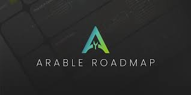

---
title: "Arable Protocol"
description: "第一个合成多链农业协议。 在此处了解有关 Arable 的更多信息 --> https://linktr.ee/arable_protocol"
date: 2022-08-03T00:00:00+08:00
lastmod: 2022-08-03T00:00:00+08:00
draft: false
authors: ["crazyxuanshao"]
featuredImage: "arable-protocol.png"
tags: ["DeFi","Arable Protocol"]
categories: ["nfts"]
nfts: ["DeFi"]
blockchain: "Avalanche"
website: ""
twitter: "https://twitter.com/ArableProtocol"
discord: "https://discord.com/invite/arable"
telegram: "https://t.me/ArableProtocol"
github: ""
youtube: ""
twitch: ""
facebook: ""
instagram: ""
reddit: ""
medium: "https://medium.com/@ArableProtocol"
steam: ""
gitbook: ""
googleplay: ""
appstore: ""
status: "Live"
weight: 
lightgallery: true
toc: true
pinned: false
recommend: false
recommend1: false
---

Arable 是世界上第一个去中心化合成农业平台，我们

正在永远改变单产农业。 Arable 是合成加密资产和收益农场的完整生态系统。任何

任何链上的资产，如果社区要求，可以成为 Arable 生态系统的一部分。 我们做多链农业

无痛，让您掌控一切。 Arable 目前可在 Avalanche 区块链和 Pangolin DEX 上使用

ticker $ACRE 很快就会在其他交易所上市。&nbsp;

