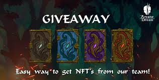
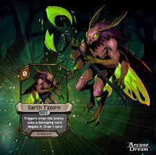

<strong>ARCANE DREAM</strong> 是一款激动人心的区块链卡牌对战游戏，将满足角色扮演者、竞技游戏鉴赏家或经验丰富的收藏家的需求。&nbsp;

这是一个独特的 P2E 项目，具有出色的图形、出色的游戏平衡性和引人入胜的故事。&nbsp;

<ul>
​    
<strong>选择你的头像，考虑你的策略并磨练你的卡组技能！</strong>
<strong>在充满活力的奥术梦境世界中挑选卡牌、打出强大的组合并击败对手！</strong>

您不仅可以参加具有挑战性的战斗，还可以购买土地、建造和设计他们的基地和农场稀有资源，这是升级卡所需的。&nbsp;

所有卡片（不包括免费卡片）都是不可替代的代币，具有自己独特的艺术和特征。您可以在游戏市场上与其他玩家一起买卖它们。游戏中会有很多地方可以赚取 NFT 代币。&nbsp;

我们希望让玩家有机会获得相同数量的奖励，无论他们玩什么模式：PVP、PVE 或元游戏！

