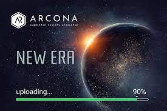
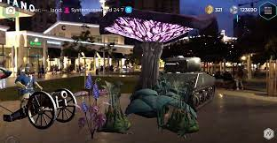

---
title: "Arcona X-Reality Universe"
description: "Arcona X-Reality Universe 将全球真实和虚拟世界融合在一起，创建了增强现实层 - 数字土地。"
date: 2022-08-03T00:00:00+08:00
lastmod: 2022-08-03T00:00:00+08:00
draft: false
authors: ["crazyxuanshao"]
featuredImage: "arcona-x-reality-universe.png"
tags: ["NFT Games","Arcona X-Reality Universe"]
categories: ["nfts"]
nfts: ["NFT Games"]
blockchain: "ETH"
website: "https://www.arcona.space/?utm_source=DappRadar&utm_medium=deeplink&utm_campaign=visit-website"
twitter: "https://twitter.com/arconametaverse"
discord: "https://discord.com/invite/cBEyJqY"
telegram: ""
github: ""
youtube: "https://www.youtube.com/c/ArconaAugmentedRealityMetaverse"
twitch: ""
facebook: "https://www.facebook.com/arconaecosystem/"
instagram: "https://www.instagram.com/accounts/login/?next=/arconadigitalland/"
reddit: ""
medium: ""
steam: ""
gitbook: ""
googleplay: ""
appstore: ""
status: "Live"
weight: 
lightgallery: true
toc: true
pinned: false
recommend: false
recommend1: false

---

Arcona 是全球增强现实生态系统，基于其自身独特的技术平台，可在全球各地自动生成增强现实的全球层。&nbsp;

实际上，它是行星表面的虚拟模型，每一米都与物理世界中的特定位置完美关联。

整个全球数字土地层被分成不同的部分——100 平方米的六边形地块。 每个地块的坐标在 Arcona 的去中心化数据库中指定和设置，并按照 ETH 721 标准在智能合约中列为不可替代的代币 Arcona Digital Land (ARDL)。

这是一个为交互式内容远程放置шт现实世界做好充分准备的数字土地情节。 这样一来，在纽约，您就可以轻松地在墨西哥城的中央广场获得一块土地，并在您家中舒适的沙发上进行互动表演。

