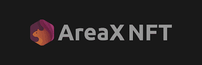

AreaX NFT 是一个基于 Marble Standard 的 NFT 市场。享受 AreaX NFT 和 Telos 区块链功能

AreaX NFT 是一个面向任何喜欢 NFT 的人的市场 AreaX NFT 将支持多种 NFT 标准，目前我们支持 Marble 标准 AreaX NFT 支持图像、音频 (MP3) 和视频 (MP4) 格式。

主要特点：

1- 简单易用

2- 无交易费

3- 现场支持

4- 高级配置文件系统

5- 创作者版税

6- 边市场

7- 在 TEVM 上支持 ERC721（即将推出）

