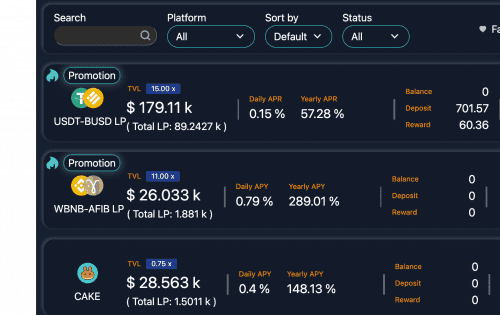

---
title: "ARIES FINANCIAL V2"
description: “ARIES FINANCIAL V2 在 BSC 上实施 Yield Farming 和二元期权。”
date: 2022-08-04T00:00:00+08:00
lastmod: 2022-08-04T00:00:00+08:00
draft: false
authors: ["sadfrog"]
featuredImage: "aries-financial-v2.png"
tags: ["DeFi","ARIES FINANCIAL V2"]
categories: ["nfts"]
nfts: ["DeFi"]
blockchain: "BSC"
website: ""
twitter: "https://twitter.com/_AriesFinancial"
discord: ""
telegram: ""
github: ""
youtube: ""
twitch: ""
facebook: ""
instagram: ""
reddit: ""
medium: ""
steam: ""
gitbook: ""
googleplay: ""
appstore: ""
status: "Live"
weight: 
lightgallery: true
toc: true
pinned: false
recommend: false
recommend1: false
---

ARIES FINANCIAL 是一个包罗万象的金融平台，旨在通过利用新颖的 DeFi 技术为用户最小化风险并最大化回报。 ARIES 被概念化为<strong>“金融的未来”或“未来的银行”</strong>。

ARIES 平台由一个 UI 组成，用于访问多个智能合约应用程序，这些应用程序促进 <strong>LP_Tokens Vault</strong>、稳定币收益、质押池、<strong>二元期权</strong>（预测市场）、利润收入 等等。&nbsp;

Christies Sg PTE 软件开发工具不断更新 ARIES 业务逻辑，以期将所有权移交给以 ARIES 平台治理令牌 AFI 的所有权为中介的去中心化组织。

