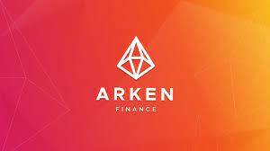

---
title: "ARKEN Finance"
description: “DEX 交易者跟踪数千种代币和合成资产的动向并预测市场动向的最佳用户体验工具。”
date: 2022-08-04T00:00:00+08:00
lastmod: 2022-08-04T00:00:00+08:00
draft: false
authors: ["sadfrog"]
featuredImage: "arken-finance.png"
tags: ["Exchanges","ARKEN Finance"]
categories: ["nfts"]
nfts: ["Exchanges"]
blockchain: ""
website: "https://swap.arken.finance/	"
twitter: "https://twitter.com/arkenfinance"
discord: ""
telegram: ""
github: ""
youtube: ""
twitch: ""
facebook: ""
instagram: ""
reddit: ""
medium: ""
steam: ""
gitbook: ""
googleplay: ""
appstore: ""
status: "Live"
weight: 
lightgallery: true
toc: true
pinned: false
recommend: false
recommend1: false
---

在时间是关键的加密领域——实时信息决定了谁将获胜。 Arken 将多个 DEX 聚合到一个平台中，允许交易者跟踪数千种代币和合成资产并预测市场走势。 我们的工具整合了来自不同链的所有代币的实时交易视图，为用户提供了一个轻松管理数字资产的单一入口。 用户可以通过限价单、价格提醒和最优利率跨链掉期等免费交易功能获得最优利率掉期。 从未如此简单。 立即查看 Arken.Finance！

