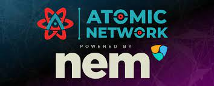
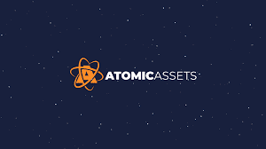

---
title: "Atomic Network"
description: "原子网络是币安智能链区块链上的 DeFi 协议"
date: 2022-08-05T00:00:00+08:00
lastmod: 2022-08-05T00:00:00+08:00
draft: false
authors: ["crazyxuanshao"]
featuredImage: "atomic-network.png"
tags: ["High risk","Atomic Network"]
categories: ["nfts"]
nfts: ["High risk"]
blockchain: "BSC"
website: "https://www.atomicnetwork.live/?utm_source=DappRadar&utm_medium=deeplink&utm_campaign=visit-website"
twitter: "https://twitter.com/TheAtomicNet"
discord: "https://discord.com/invite/NYckWsGbqT"
telegram: "https://t.me/atomicnetwork"
github: "https://github.com/atomicnetwork"
youtube: "https://www.youtube.com/channel/UC_BQhyjLL2W83tcHBGjRP1w"
twitch: ""
facebook: ""
instagram: ""
reddit: "https://www.reddit.com/user/Atomic_Network"
medium: "https://medium.com/@atomicnetwork"
steam: ""
gitbook: ""
googleplay: ""
appstore: ""
status: "Live"
weight: 
lightgallery: true
toc: true
pinned: false
recommend: false
recommend1: false
---

Atomic Network 是 Binance Smart Chain 区块链上的 DeFi 协议，有助于利用原生 Binance Smart Chain 资产创建完全抵押的稳定币。

🟢 总供应量 - 7.5 亿

🔥所有剩余的预售代币将被 100% 销毁！！！

🔒 流动性将被锁定

🚀 专业开发人员

🚀 强大的社区

💎 获得 30% BNB + 70% ATOM 奖励！ 💎

# 原子网络：世界上第一个免息稳定币协议基于币安智能链

币安智能链区块链上的 DeFi 协议，有助于利用原生币安智能链资产创建完全抵押的稳定币

### 什么是原子网络？

Atomic Network 是 Binance Smart Chain 区块链上的 DeFi 协议，它有助于利用原生 Binance Smart Chain 资产创建完全抵押的稳定币。

