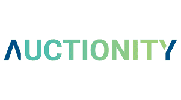

世界上最大的加密收藏品区块链拍卖行 - Auctionity 是一个基于以太坊区块链的 Dapp，用于拍卖以太坊中的 NFT。 拍卖允许参与者在全球分散的网络上实时创建拍卖、竞标和购买商品，同时保持支付和交付保证。 我们的目标是通过区块链技术的独特应用彻底改变拍卖世界。 该平台是有史以来第一个 100% 基于区块链的应用程序，使人们能够在拍卖中出售不可替代的代币 (NFT)。 社区是该项目的核心：由于用户，拍卖变得病毒式传播，让每个人都可以通过在平台上推广拍卖来赚钱。 拍卖是交互式的且易于使用。 例如，现场拍卖可以由称为“拍卖师”的成员进行，他们可以在通过动画拍卖销售获得乐趣的同时赚钱！

