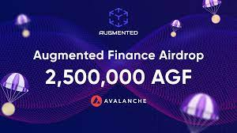
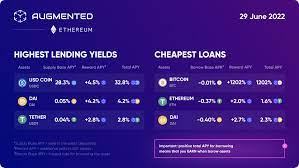

Augmented Finance 是下一代 DeFi 流动性协议，具有完全跨链兼容性，可将跨链的流动性合并，让用户在多条链上同时借贷。

Augmented Finance 是多链流动性的基础，并支持新兴数字资产的长尾，让用户可以将这些资产投入使用，同时保持其长期价值。

Augmented Finance 已在 Avalanche、Binance Smart Chain、Ethereum、Gnosis 上线，并很快在其他流行的 L1/L2 链上推出。

<strong>Augmented Finance 以一种巧妙的方式设计以提高采用率：</strong>

<ul>
  <li>Ava​​lanche、币安智能链、以太坊上最受欢迎的代币的高 APY 以及加速收益耕作</li>
  <li>通过抵押 AGF 代币可提高 4 倍 APY</li>
  <li>质押 DEX LP 的高 APY</li>
  <li>Ava​​lanche、币安智能链、以太坊上的独特借贷池（其他借贷协议不可用）。</li>
</ul>

<strong>易于使用：</strong>

<ul>
  <li>用户友好的界面</li>
  <li>Discord 中的 24/7 用户支持</li>
</ul>

<strong>顶级安全：</strong>

<ul>
  <li>非托管和开源协议</li>
  <li>Chainlink 预言机价格反馈</li>
  <li>由 PeckShield 审核</li>
</ul>

