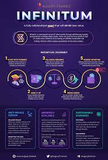

---

title: "Augury Finance"
description: "Augury Finance 是一个 DeFi 平台，提供三重收益优势（每周股息、航空邮件和质押）."
date: 2022-08-05T00:00:00+08:00
lastmod: 2022-08-05T00:00:00+08:00
draft: false
authors: ["crazyxuanshao"]
featuredImage: "augury-finance.png"
tags: ["DeFi","Augury Finance"]
categories: ["nfts"]
nfts: ["DeFi"]
blockchain: "Polygon"
website: "https://augury.finance/?utm_source=DappRadar&utm_medium=deeplink&utm_campaign=visit-website"
twitter: "https://twitter.com/AuguryFinance"
discord: "https://discord.com/invite/576EUqQKej"
telegram: "https://t.me/joinchat/auguryFinance"
github: ""
youtube: ""
twitch: ""
facebook: ""
instagram: ""
reddit: ""
medium: "https://auguryfinance.medium.com/"
steam: ""
gitbook: ""
googleplay: ""
appstore: ""
status: "Live"
weight: 
lightgallery: true
toc: true
pinned: false
recommend: false
recommend1: false
---

Augury Finance 是一个 DeFi 平台，可提供三重收益优势（每周股息、航空邮件和质押）。 &nbsp;此外，新项目可以通过 Augury Finance Cauldron 启动。

Augury Augury 是一支才华横溢的开发人员团队，他们来自商业世界的各个学科。凭借 100 多年的经验，该团队以新的视角接近 Defi，这是创新和解决 Defi 中最大挑战的一种方式。该团队构建创新产品，重点关注可持续性和风险缓解。我们已经看到了未来，那就是预兆！

