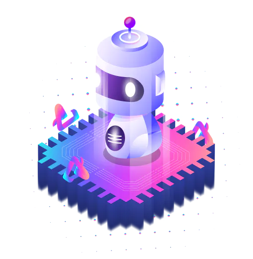

---
title: "AuraSwap"
description: "AuraSwap 是一个 AMM 去中心化交易所和 Polygon 链上的 Yield Farming，gas 费用接近于零。 AURA 的核心是生态系统的驱动力"
date: 2022-08-05T00:00:00+08:00
lastmod: 2022-08-05T00:00:00+08:00
draft: false
authors: ["crazyxuanshao"]
featuredImage: "auraswap.png"
tags: ["Exchanges","AuraSwap"]
categories: ["nfts"]
nfts: ["Exchanges"]
blockchain: "Polygon"
website: "https://www.auraswap.finance/home?utm_source=DappRadar&utm_medium=deeplink&utm_campaign=visit-website"
twitter: "https://twitter.com/AuraSwapDEX"
discord: "https://discord.com/invite/rmUQWrmynf"
telegram: "https://t.me/AuraSwapDEX"
github: "https://github.com/AuraSwap-DEX"
youtube: ""
twitch: ""
facebook: ""
instagram: ""
reddit: "https://www.reddit.com/r/AuraSwapDEX/"
medium: "https://medium.com/auraswapdex"
steam: ""
gitbook: ""
googleplay: ""
appstore: ""
status: "Live"
weight: 
lightgallery: true
toc: true
pinned: false
recommend: false
recommend1: false

---

什么是 AuraSwap？ 为什么选择 AuraSwap？ $AURA 是什么

<strong>AuraSwap</strong> 是多边形链上的 AMM 去中心化交易所和收益农业，gas 费用接近于零。 $AURA 的核心是生态系统的驱动力。

AuraSwap 是一款专为在 Polygon Chain 上使用而设计的产品。 易于使用并且费用接近0％，您可以感受到费用的轻盈。 我们专注于开发安全、快速的产品。 这就是我们的信念和愿景。

我们正在计划 <strong>公平发布</strong>、<strong>不预售</strong>和<strong>不预挖</strong>，将于 <strong>2022 年 6 月 24 日开始 </strong> 在<strong> 13.00 UTC</strong>

<ul>
   <li>代币名称：<strong>AURA</strong></li>
   <li>Chian：<strong>Polygon 主网（以前的 MATIC）</strong></li>
   <li>最大供应量：<strong>100,000,000 AURA</strong></li>
</ul>

