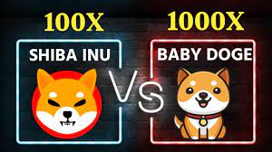
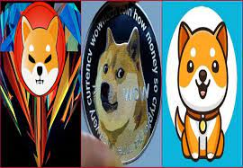

Baby Doge Shiba Inus 是一个基于币安智能链的去中心化模因友好型金融平台，专为加密交换协议 (BEP-20) 而设计。

我们的团队开发了社区驱动的项目，为 Shiba Doge Lovers 社区赋能。

Baby Doge Shiba Inus 解决了当前货币市场的问题。 Baby Doge Shiba Inus 在交易过程中提供快速的交易速度，有助于抵御黑客或通过网络攻击窃取，因为我们的开发团队创建了一个具有最大安全性和活动性的独特平台，以最佳地节省时间和成本； 从而将去中心化 meme 加密货币平台的地位发展到数字金融的新篇章。

