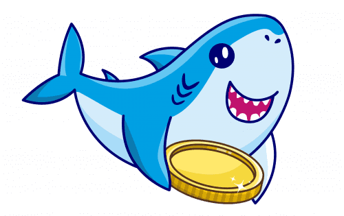
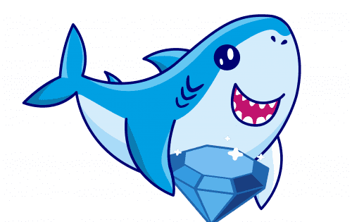

Baby Shark (SHARK) 是基于经典儿歌部署在币安智能链上的 BEP-20 智能合约，旨在提供新颖的通货紧缩代币经济学，奖励社区，同时与专注于清理海洋的非营利组织合作。 Baby Shark 团队相信为其持有者增加长期价值，同时对环境产生持久影响。

Baby Shark Token 是一个社区驱动、经过审计和安全的自主 DeFi 协议，利用了《新闻周刊》、《财富》和《彭博新闻》中经典儿歌的力量。

