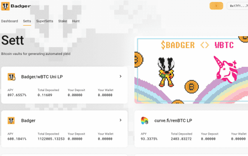
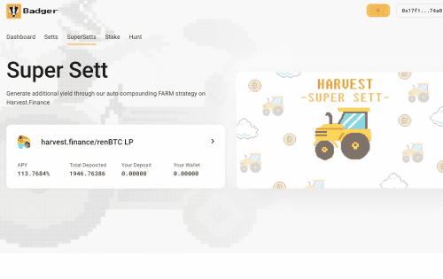

---
title: "Badger.Finance"
description: "adger Finance 是一个社区 DAO，专注于将比特币引入 DeFi。"
date: 2022-08-08T00:00:00+08:00
lastmod: 2022-08-08T00:00:00+08:00
draft: false
authors: ["crazyxuanshao"]
featuredImage: "badger-finance.png"
tags: ["DeFi","Badger.Finance"]
categories: ["nfts"]
nfts: ["DeFi"]
blockchain: "ETH"
website: "https://app.badger.com"
twitter: "https://twitter.com/BadgerDAO"
discord: "https://discord.com/invite/badgerdao"
telegram: ""
github: ""
youtube: ""
twitch: ""
facebook: ""
instagram: ""
reddit: ""
medium: ""
steam: ""
gitbook: "https://docs.badger.com/badger-finance/"
googleplay: ""
appstore: ""
status: "Live"
weight: 
lightgallery: true
toc: true
pinned: false
recommend: false
recommend1: false

---

与 dOrg 合作开发

4 位长期加密货币投资者齐心协力，共同创新 DAO 的运营、发布和产品化方式。 到目前为止，我们自己创建并资助了 Badger DAO，目的是在发布时将控制权交给社区。 有些人将继续领导 DAO 的运营，而其他人将继续担任顾问角色。

dOrg 是一个开发集体，用于构建自定义 DAO、DeFi 产品和 web3 工具。 他们帮助领导设计、编码并确保项目立即交付其区块链产品。 他们曾与 Balancer、The Graph、DeversiFi 和 DAOstack 等行业领先的项目合作。

