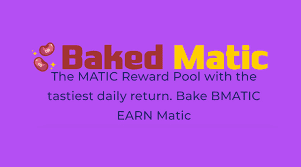
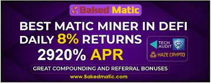

---
title: "Baked Matic"
description: "MATIC 奖励池，每日回报最丰厚。 烘焙 BMATIC 每天赚取 8% Matic"
date: 2022-08-14T00:00:00+08:00
lastmod: 2022-08-14T00:00:00+08:00
draft: false
authors: ["crazyxuanshao"]
featuredImage: "baked-matic.png"
tags: ["High risk","Baked Matic"]
categories: ["nfts"]
nfts: ["High risk"]
blockchain: "Polygon"
website: "https://bakedmatic.com/?utm_source=DappRadar&utm_medium=deeplink&utm_campaign=visit-website"
twitter: "https://twitter.com/bakedmatic"
discord: ""
telegram: "https://t.me/bakedmatic"
github: "https://github.com/Tech-Audit/Smart-Contract-Audits/blob/main/TECHAUDIT_BAKED%20MATIC.pdf"
youtube: ""
twitch: ""
facebook: ""
instagram: ""
reddit: ""
medium: ""
steam: ""
gitbook: ""
googleplay: ""
appstore: ""
status: "Live"
weight: 
lightgallery: true
toc: true
pinned: false
recommend: false
recommend1: false
---

<strong>BakedMatic</strong> 智能合约基本上是一个锁定的质押奖励池，存入的资金在 dApp 上转换并表示为“Beans”。 该项目每天将支付您高达 8% 的投资。

您选择是否：

“吃豆子”——每天领取奖励

“重新烘焙”——复合您的投资。

# SolidProof 的区块链安全性

我们专注于审计智能合约，可以使用手动和自动测试在您的区块链项目中发现漏洞。通过我们内容丰富的报告，您可以为您的社区带来良好的安全感。

在日益全球化的经济中，金融机构更容易受到非法犯罪活动的影响。了解您的客户 (KYC) 标准旨在保护金融机构免受欺诈、腐败、洗钱和恐怖主义融资的侵害。

✅ 合规证书
✅ 漏洞报告和代码建议
✅ 自动化漏洞测试（Slither、MythX、自定义脚本）
✅ 手动安全测试（手动代码检查，SWC-Registry）

