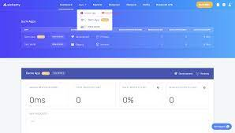
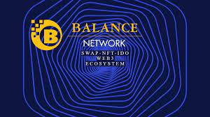

将创建 BLN 作为 Balance Network 平台的货币，并执行一些行动，例如奖励社区和投资 Balance Network 生态系统。 将创建 300.000.000 BLN 代币将用作 Balance Network 平台 NFT 生态系统中的实用程序，既作为原生协议代币又作为应用程序代币。 然而，如前所述，一旦平台的全面开发完成，Balance Network 平台将成为一个完全去中心化的 CEX、DEX、IDO、NFTS 和游戏平台。 BLN 代币总供应量 300.000.000 - 150.000.000 1 年锁定

## 加密，它应该是怎样的。

### 方便使用的

Balance Network 中的每个组件都是完全互连的，使我们能够提供您无法通过单独的系统获得的功能。我们对 Balance Network 的主要关注是让您的加密体验尽可能流畅和直观

### 贸易

BLN 是币安智能链上的实用代币，作为整个平衡网络的结缔组织。它是我们技术的核心，是我们支持无缝跨链交易的原因安全

### 安全

 虽然用户体验是我们的重点，但安全性是我们的首要任务。我们从头开始设计平衡网络以尽可能安全

。