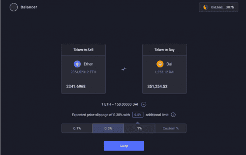
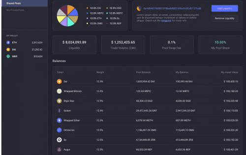

基本协议内置的灵活性。 Balancer 有私人池，只有你可以添加或删除流动性，在再平衡智能池中赚取 cDai 之上的交易费用，加入具有单一资产的多代币池，随着时间的推移不断调整权重以实现动态策略。 您还可以在新池中使用 Balancer Pool 代币来获得流动性敞口或动态掉期费用，以根据基础波动性进行调整。

## 对于投资者

# 自动产生收益和再平衡的投资组合

Balancer 颠覆了指数基金的概念：您无需向投资组合经理支付费用以重新平衡您的投资组合，而是向通过套利机会重新平衡您的投资组合的交易员收取费用。

1.经过战斗测试和安全

2.资金和天然气效率

3.赚取 $BAL 代币奖励

