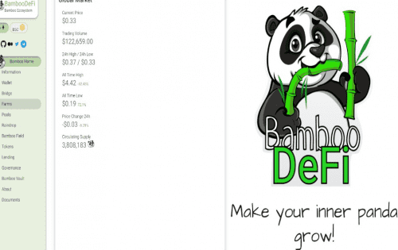
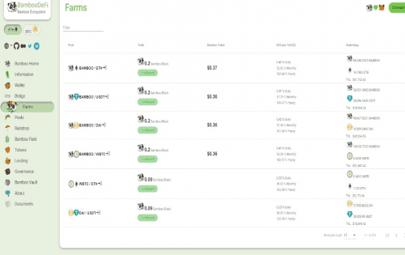

<strong>BambooDeFi</strong> 现在是 <strong>Binance 智能链</strong> 的一部分，在 <strong>PancackeSwap</strong> 平台上运行并允许 Bamboo 代币持有者转换其 ERC-20通过在 ETH 部分的 <strong>www.BambooDeFi.com</strong> 上部署和访问的网桥连接到 BEP-20。

经过<strong>Red4Sec</strong>公司数周的审核，智能合约现已全面审核，以确保用户的安全。可以在项目网站的文档区域中查看审核。

现在，Bamboo 是一只在两条区块链上运行的数字熊猫，它的追随者可以在以太坊和币安网络之间交换价值。更不用说在其池中成对提供流动性和种植代币的特殊财务激励措施。&nbsp;

此优惠与其他产品一起完成... <strong>赌注、彩票或 YieldFarming 系统乘数。即使可以选择通过联合运营来提高产量。 （还有一些已经在筹备中并将在不久的将来推出的惊喜）。</strong>

流动性可以通过 PancakeSwap 添加到 BUSD/BAMBOO 和 BNB/BAMBOO 对。&nbsp;

但是，在 BambooDeFi.com 自己的网站上，流动性也可以添加到 BTCB、CAKE、USDT、DAI 和 CBK（穿越黄块纪录片中的代币）。

&nbsp;在接下来的几周内，将添加新的配对以扩大选择范围。&nbsp;

<strong>已在 Pancakeswap、Uniswap、MEXC、Gate.io 和托克派。</strong>

<strong>熊猫呆着！ ！</strong>

