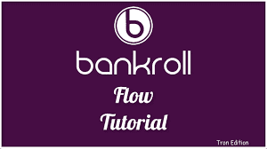
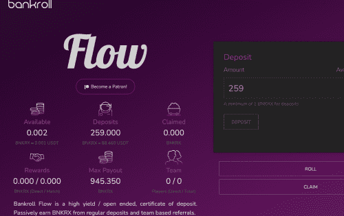

Bankroll 是 TRON 和以太坊上首屈一指的去中心化金融网络。 它实现了一个自愿的、可持续的和无需许可的全球经济引擎。 通过金融合约网络，该平台提供 TRX、ETH、BTT、VLT 和 BNKR 奖励。 资金...为胜利而战！！！

## 关于

Bankroll Daily 是一个由 4 小时轮次驱动的高股息信用池。在每轮中选出 2 名获胜者，购买最多门票的鲸鱼和随机选择的玩家；头奖分为 60/40。

门票分配：
68% 进入玩家红利池，10% 通过池即时支付，20% 进入滚动累积奖金，2% 用于推荐/维护费。

