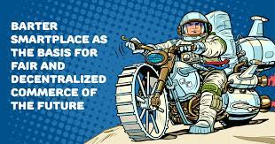

Barter Smartplace 有一个关键功能 - 基于使用电子签名的数字法律合同进行交易。今天，随着技术和法律框架的发展，通过数字通信远程签订贸易协议和签署法律文件已成为可能。我们利用这些机会为客户提供优质服务，以签订任何复杂的合同。所提供服务的质量包括以下主要原则：安全性、便利性和可访问性。&nbsp;

我们生态系统的主要细节是形成数字化实物资产登记册——房地产、交通、宝石和金属、艺术品、珠宝等的代币化。在此基础上，我们将创建最大的市场用于易货、拍卖和直接交易，在交易或出售任何实物和数字资产期间都会有需求。在 Barter Smartplace，您可以用汽车换公寓，用黄金或珠宝买房，用地块换取公司或股票的股份，用您的服务支付其他服务甚至商品，以及实现许多其他选择易货关系。

