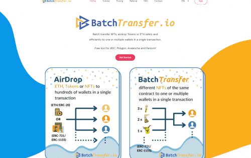

多链工具可在单次交易中安全、高效地将 NFT、空投代币或代币批量转移到一个或多个钱包。 &nbsp;&nbsp;在很多链上免费使用。 支持：ETH、BSC、Polygon、Avalanche、&nbsp;Fantom 等等

## 推荐一次，永远红利

1.生成您的推荐链接

2.与您的朋友和社交媒体分享您的推荐链接

3.您的朋友第一次使用链接中的 BatchTransfer

4.您获得 20% 的奖励 + 您的朋友每次获得 10% 的折扣

##  BatchTransfer 能做什么？

BatchTransfer 是这样一款 D 款，可帮助用户在单笔交易中顺利地应用批量发送到多个 NFT，一个或多个 ETH ，并投入 40%-70% 的交易费用（气）。您可以使用此 Dapp 在的钱包之间转移，将 ETH 抽出 NFT 到您的钱包以参与 N 个项目的奖品，并将您的 ETH ERC20 代币投到任意数量的钱包

