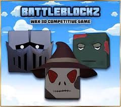
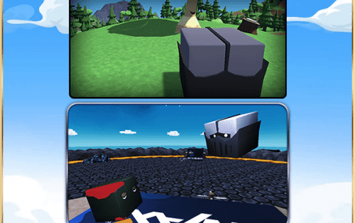

BattleBlockz 是 Zexie Studios 打造的第一款 3D 竞技 WAX 游戏。区块链已被一个名为 The Ravenous 的派系感染。你会选择加入他们的世界统治目标，还是与 The Collective 联手拯救我们所钦佩的 The Wax 区块链。&nbsp;

凭借 10 多年的竞技游戏和开发经验，我们有信心为 WAX 区块链提供第一个独特的竞技平台。 Battleblockz 将构建的不仅仅是一个赢得竞争性游戏的游戏，因为我们的目标是为公众提供一种将加密游戏提升到一个全新水平的方法。在我们的竞技平台发布之前，我们将在我们自己的游戏中使用这个平台来证明它是一个工作系统。&nbsp;

3D 游戏 BattleBlockz 将提供每月锦标赛、排行榜和边缘游戏供所有人享受。这些比赛将在 Theta.tv、Twitch 或 Youtube 等平台上以真实的解说员进行直播。&nbsp;

