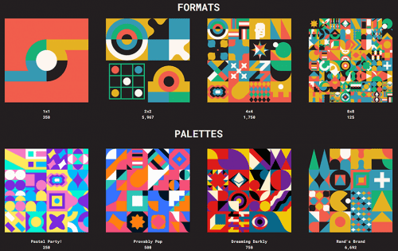
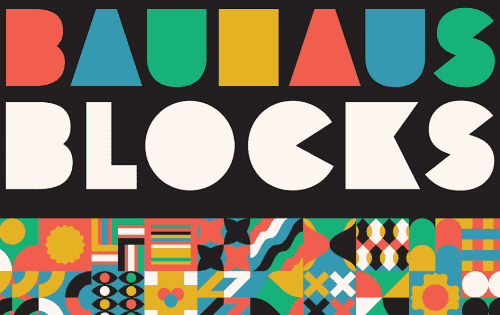

Bauhaus Blocks 是 8192 个可证明稀有的受包豪斯启发的 NFT 的生成集合。 由 372 个独特的块以四种不同的格式和调色板连接而成。 &nbsp;第一个“风格指南”，包豪斯引发了极简主义和平面设计。 它将技术实力与美学原则相结合，创造出一种有凝聚力的视觉语言，这是生成艺术的精髓。

# 额外的

所有 372 块独立的包豪斯积木均由Carty Sewill命名、标记和手工制作。借助流行元素、Art101 回调、传统包豪斯造型和每个人都喜欢的密码，包豪斯街区是一个有趣的艺术史内省。为了稀有，元数据中有额外的花絮，比如对、两对、旅行和四边形。

# 建造房屋

包豪斯是 19 世纪早期的艺术运动，它综合了工艺、技术和美学。寻求创作一部“全作品”。或者说，多件作品通过审美统一作为一个作品。

这个想法有助于创造简单的几何形状，具有凝聚力，包豪斯的“品牌”。包豪斯具有建筑风格，激发了弗兰克劳埃德赖特等人的灵感，并在保罗兰德达到了顶峰。

第一个“风格指南”，包豪斯引起了极简主义和平面设计。它将技术实力与美学原则相结合，创造出一种有凝聚力的视觉语言，这是生成艺术的精髓。

