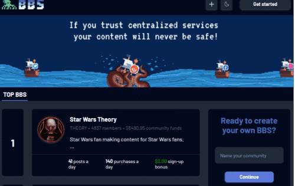
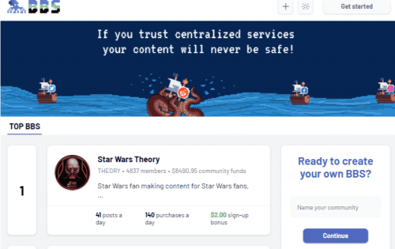

<strong>BBS 是用户拥有的留言板网络</strong>

BBS 就像一个有版主的 reddit 论坛，现在分散在任何网站上运行。 网络本身就是所有 BBS 板的集合，无论它们在哪里。 &nbsp;任何人都可以在任何主题上创建 BBS，并在自己的域上运行它。 每个帖子实际上都是一个 NFT，用户可以创建、购买、出售并从他们拥有的帖子的广告空间中收取收入。

##  收入在生态系统之间自动 共享

BBS 管理员（所有者）
社区版主 
内容发布者（帖子）
操作员（网络主机）

开发人员（新功能）

## BBS 是抗审查的

BBS留言板软件利用区块链技术作为公共数据库。这意味着所有 BBS 用户、内容和钱包都可以随时恢复，并且永远不会被任何人审查、关闭、扣押或更改，甚至 BBS 也不行。 

