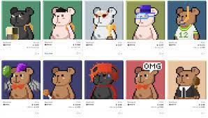
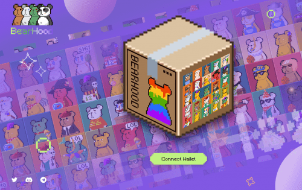

---
title: "Bearhood"
description: "🐾BearHood🐾
a collection of 10,000 pixel bear NFTs 🧸
Unique digital collectibles living on the blockchain, future masterpiece of pixel collections."
date: 2022-07-31T00:00:00+08:00
lastmod: 2022-07-31T00:00:00+08:00
draft: false
authors: ["Metabd"]
featuredImage: "bearhood.png"
tags: ["Collectibles","Bearhood"]
categories: ["nfts"]
nfts: ["Collectibles"]
blockchain: "ETH"
website: "https://dappradar.com/deeplink/12759"
twitter: "https://twitter.com/BearhoodNFT"
discord: "https://discord.com/invite/QQpA5snRqf"
telegram: ""
github: ""
youtube: ""
twitch: ""
facebook: ""
instagram: "https://www.instagram.com/bearhood.eth/"
reddit: ""
medium: ""
steam: ""
gitbook: ""
googleplay: ""
appstore: ""
status: "Live"
weight: 
lightgallery: true
toc: true
pinned: false
recommend: false
recommend1: false

---

Bearhood<strong>是10,000像素熊NFTs的集合——生活在区块链上的独特数字收藏品</strong>，旨在成为Web3浪潮下的像素收藏杰作。

2021 年初由 Pixel 粉丝组成的团队，BearHood 诞生于元界，并由此确定了它的定位至今。

像素通常被认为是数字图像中最小的单个组件。 这使得像素艺术经典，占用资源更少，更易于使用。 这些特点让 BearHood 更容易被接受，因为它具有 100 年后的复古美学。

熊熊是数百种艺术元素融合而成，每只熊都是独一无二的。

