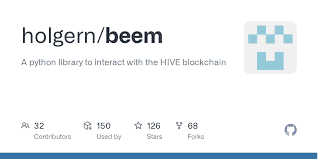
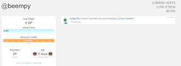

beempy 是一个方便的 CLI 实用程序，可让您管理您的钱包、转移资金、检查余额、帖子等。
该工具可以使用 pip install beem 安装，并且可以通过在终端中键入 beempy 来启动。

## 使用钱包

beempy让您可以利用您的 BIP38 加密钱包对您的帐户执行各种操作。

第一次使用beempy时，系统会提示您输入密码。此密码将用于加密包含您的私钥的beempy钱包。

您可以通过changewalletpassphrase命令更改密码。

