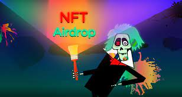
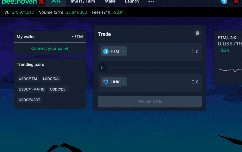

Beethoven X 基于 Balancer V2 构建，是 Fantom Opera 上的第一个下一代 AMM 协议

根据您所需的资产配置创建一个独特的加密指数基金。通过跟踪套利机会向重新平衡您的资金的交易者收取费用。

Balancer V2 通过汇集来自投资者投资组合的众包流动性并使用其独特的智能订单路由器为交易者寻找最佳可用价格来实现高效交易。

使用 LGE 以最公平的方式启动您的代币。使用 80/20 BPT 而不是单一质押来捕捉市场波动，同时将无常损失降至最低。