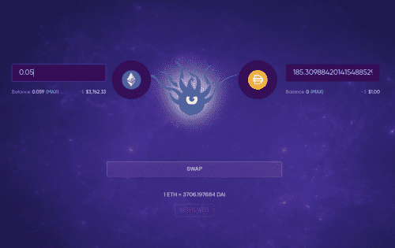

Behodler 是一种通缩协议，以高效、低 gas、单面 AMM 为中心，具有由 MEV 捕获代币经济学提供支持的通用流动性代币。 Behodler 在提供比传统 AMM 更低的无常损失的同时，作为通常在第 2 层发现的收益策略批发商而大放异彩：只需在 Uniswap 上交易一半的天然气，您就可以进出您最喜欢的主网收益农场。

Behodler 在交换时获取一部分套利利润，并将价值重定向到称为 Pyrotokens 的包装代币的超通缩循环中。流动性代币稀缺性在转移时会燃烧，导致 Behodler 中越来越多的流动性不可赎回。从本质上讲，Behodler 有一个流动性下限，随着稀缺性燃烧的增加而增加。

最后一块拼图是算法稳定币 Flan，它的价值利用 Behodler 的潜在流动性作为 Behodler 即将推出的社区治理农业 dapp Limbo 的奖励代币。&nbsp;

## 适用于流动性提供者和交易者的创新产品套件

虽然提供比传统 AMM 更低的无常损失，但 Behodler 作为通常在第 2 层发现的收益策略批发商大放异彩：对于 Uniswap 等替代品交易的一半天然气，您可以进出您最喜欢的主网收益农场

