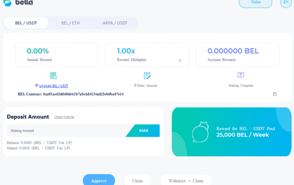
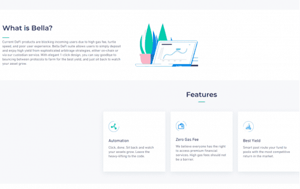

当前的 DeFi 产品由于高昂的 gas 费、龟速和糟糕的用户体验而阻止了新用户。 Bella DeFi 套件允许用户通过复杂的套利策略简单地存入并享受高收益，无论是在链上还是通过我们的托管服务。 借助优雅的一键式设计，您可以告别在协议之间跳来跳去的农场以获得最佳收益，而只需坐下来观看您的资产增长。

- Bella Protocol 的计划产品包括：
  - **Bella流动性挖矿**：用户可以质押Curve、ARPA/USDC、BEL/USDC流动性提供者（LP）代币，获得BEL奖励。
  - **Bella Flex Savings**：为稳定币和其他加密货币提供跨平台套利收益农业策略。
  - **Bella One-Click**：智能门户，用于通过 Bella 的托管服务在流行的 DeFi 产品上部署资产，并提供补贴的 gas 费用。
  - **Bella Lending**：支持 LP 代币和结构性金融产品的去中心化借贷产品。
  - **Bella Robo-Advisor**：根据用户风险状况生成定制的指数组合、收益稳定币和其他加密资产。
- BEL 代币可在 Bella Protocol 平台中用于**质押、收费、Bella 服务折扣以及投票和治理**。
- Bella Protocol通过 2020 年 8 月进行的私人代币销售共筹集了**4.50MM 美元，以0.75 美元 / BEL**的价格出售了总代币供应量的6.00%

