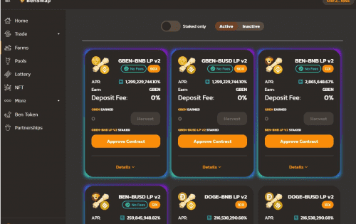
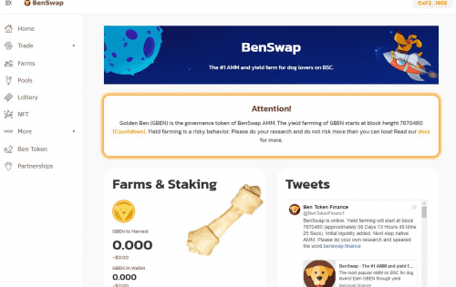

BenSwap 是 Ben Token 生态系统的一部分，目的明确：

我们希望成为狗币、动物币和 meme 币的最佳 DEX 和孵化器。

我们如何做到这一点？

<ol>
   <li>我们从治理代币 Golden Ben (GBEN) 的收益耕作开始。</li>
   <li>之后，我们全速前进并开发我们的原生 AMM。</li>
   <li>然后，我们通过 IBO（Initial Ben Offering）和其他方式与有前途的 meme 硬币建立合作伙伴关系，以扩大我们的社区并增加 DEX 的流动性。</li>
   <li>我们添加了其他通货紧缩功能。</li>
</ol>

我们希望这些步骤与适当的代币经济学一起能够带来 Ben 生态系统的良性循环。

请加入我们的旅程。 我们走吧！

