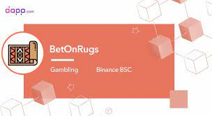
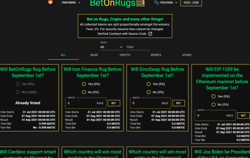

赌地毯、加密货币和许多其他东西！

###### 投注地毯、加密货币和许多其他东西！

所有收集的代币将按比例分配给获胜者。

费用：2%。出于安全原因，费用不能更改。

##### 什么是 ProcArt ？

ProcArt 是币安智能链 (BSC) 上的第一个去中心化应用 (dApp)，专注于销售程序生成艺术的不可替代代币 (NFT)。

##### 什么是程序生成的艺术？

程序生成是一种通过算法而不是手动创建数据的方法，通常通过将人工生成的资产和算法与计算机生成的随机性和处理能力相结合。

