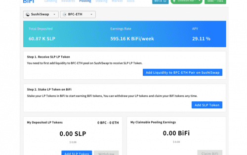
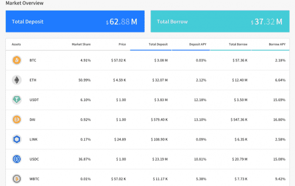

BiFi 是第一个基于通用多链中间件 BIFROST 的多链 DeFi 平台。 在 BIFROST 的多链技术的支持下，BiFi 连接到以太坊、币安智能链 (BSC)、Avalanche、Klaytn、比特币以及无限数量的网络。 BiFi 旨在创建一个去中心化的金融基础设施，将目前隔离在每个区块链上的所有资本市场连接起来，并创建跨多个区块链互操作的新产品和服务。

# 为什么选择BiFi?

## 多链

BIFROST开创性的多链技术实现了所有原生链的连接，而不仅限于以太坊。在BiFi 上，任何人都可以以去中心化的方式将加密货币从-个本地链借贷到另一个本地链。

## 安全

黑客和欺诈已经污染了区块链生态系统。我们的黑客、研究人员和安全专家团队致力于维护最高的安全标准。有了我们，您可以安全地使用您的资金

## DeFi与BTC

如果你想投资你的比特币这个世界上最大的数字资产，你只能在中心化交易所进行。BiFi 是第一个支持真实BTC的去中心化金融服务，而不仅仅是挂钩。您可以在区块链上查看已发布的交易。

