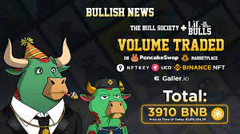
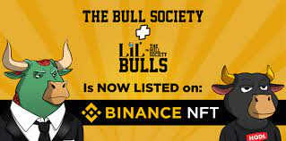

币安公牛协会是由 7,777 只独特的手绘公牛组成的集合，这些公牛生活在币安智能链上。 每只币安公牛都有自己独特的 DNA，这意味着永远不会有与您相同的 DNA！ 每一代都有 7 个不同的特征，包括背景颜色、基础颜色、嘴巴、眼睛、衣服、帽子和 道具。

### 这个怎么运作

Bull Society 是生活在 BNB 智能链上的 7,777 只独特的手绘公牛的集合。
每只公牛都有自己独特的 DNA，这意味着永远不会有一个与您的相同！
每一代都有七个独立的特征，包括背景颜色、基础颜色、嘴巴、眼睛、衣服、帽子和道具。

您的 NFT 作为 ERC721 代币存储在 BNB 智能链上并托管在 IPFS 上，确保它永远不会离开互联网

