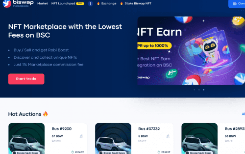
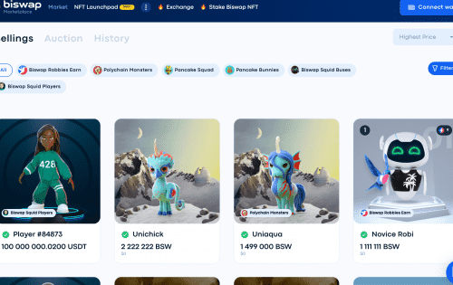

Biswap NFT 市场在 BSC 上具有 1% 的最低佣金！

<strong>竞争优势：</strong>

1. &nbsp;最低佣金为 1%

2. &nbsp;Robi Boost 中的佣金回报

3. 独家 NFT 拍卖

4. 提供购买

5。 BSW燃烧机制

在 BNB 链上最先进的 DEX 交易、赚取、推荐享受最低的交易费用、盈利的功能和多类型推荐计划立即交易

我们的战略投资者币安实验室是币安的风险投资和孵化器，宣布对 Biswap 进行战略投资。 两家公司的协同合作将带来新的高质量产品和服务、技术提升以及进一步的全球扩张。

