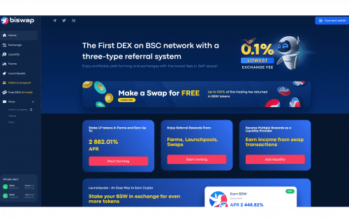
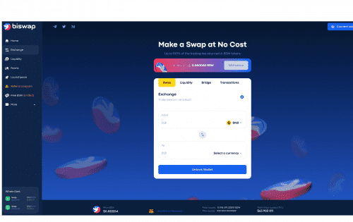

<strong>Biswap 的优势包括：</strong> <strong>BSW</strong> 是在币安智能链网络上推出的 BEP20 代币。 它是 Biswap 的主要资产。&nbsp;

<strong>Biswap</strong> — 币安智能链上的第一个 DEX，具有三类推荐系统，业内费用最低。&nbsp ;

Biswap 致力于不断发展，旨在为用户提供最舒适的服务。 让我们看看它为您准备了哪些很棒的功能！

✔最低交易费——每次掉期 0.1%

&nbsp;✔盈利的流动资金池

&nbsp;✔ 三类转介系统&nbsp;

✔CertiK Audit &nbsp;

✔SAFU保险基金&nbsp;

✔Farms &amp; Launchpools

该平台为 Exchange 提供了大量机会和多种选择。 此外，还有 Farms、Launchpools、Liquidity Pools &amp; 更多以最大化您的利润。

