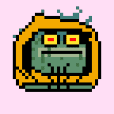

---
title: "Bitcoin Toadz"
description: "Bitcoin Toadz is a derivative project of CrypToadz built on Stacks, with ownership settled on the Bitcoin blockchain. Mint your Toad for 1STX & get free airdrop"
date: 2022-07-31T00:00:00+08:00
lastmod: 2022-07-31T00:00:00+08:00
draft: false
authors: ["Metabd"]
featuredImage: "bitcoin-toadz.png"
tags: ["Collectibles","Bitcoin Toadz"]
categories: ["nfts"]
nfts: ["Collectibles"]
blockchain: "Stacks"
website: "https://bitcointoadz.com/?utm_source=DappRadar&utm_medium=deeplink&utm_campaign=visit-website"
twitter: "https://twitter.com/BitcoinToadz"
discord: "https://discord.com/invite/qZAH7Tyq7K"
telegram: ""
github: ""
youtube: ""
twitch: ""
facebook: ""
instagram: ""
reddit: ""
medium: ""
steam: ""
gitbook: ""
googleplay: ""
appstore: ""
status: "Live"
weight: 
lightgallery: true
toc: true
pinned: false
recommend: false
recommend1: false

---

加入 CrypToadz 生态系统。 只需 1 个 STX 即可铸造 Bitcoin Toadz 并免费获得 Bitcoin Toadz 3D 空投。

Bitcoin Toadz 是 CrypToadz 的衍生项目，建立在 Stacks 上，所有权在比特币区块链上结算。

 将有 6 969 件物品可用——就像最初的 CrypToadz 一样。

薄荷价格仅为 1 STX。 我们鼓励每个人铸造更多的碎片。

每个 Bitcoin Toadz 持有者都将获得 1:1 的免费空投 Bitcoin Toadz 3D，这意味着每个铸造的 NFT 将等于一个空投的 NFT。

