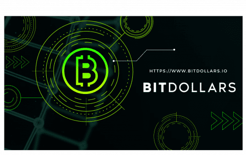
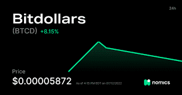

<strong>BTCD 是一种实用奖励代币，可用于访问各种服务。</strong>

在币安区块链上，BTCD 是一种 BNB 币。能源网络包括一个奖励和激励用户积极参与平台的生态系统。 BTCD 可以在所有能源平台上使用。

我们的平台包括一个治理和实用代币，它授予其所有者投票权。在我们的平台上，我们将持续投放代币。对于投币，我们将向任何需要的人提供我们的代币。

BTCD 是一种功能性实用代币，用作 Bitdollars 平台上参与者之间以去中心化方式进行的交换媒介。

BTCD 代币的目标是在 Bitdollars 平台上的生态系统内交互的参与者之间提供一种方便、安全的支付和结算方式。

<strong>通过 Staking、Pooling、在彩票中赢取代币或在交易所购买。通过以下方式利用 BTCD：</strong>
<ul> <li>将其存入矿池以赚取免费代币</li> <li>在收益农场使用代币赚取更多 BTCD</li> <li> Bitdollars 的未来还有很多，请查看我们的路线图了解更多详情。</li></ul>
<strong>排放率：</strong>
<ul> <li>按块：<strong>10</strong></li> <li>每天：<strong>288,000</strong></li></ul>
<strong>除上述之外，动态BTCD 也以 10% 的比例铸造到 Dev 地址：</strong>
<ul> <li>这意味着如果收获 100 BTCD，则另外铸造 9.09 BTCD 并发送到开发者地址。</li></ul>

