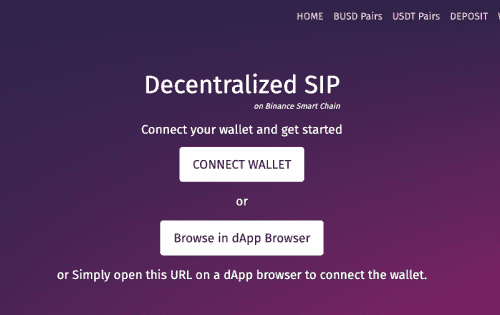
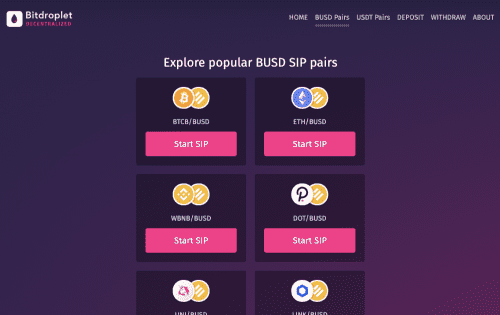

---
title: "Bitdroplet Decentralised SIP"
description: "Bitdroplet 分散式 SIP 平台，供全球加密用户使用，让他们拥有堆叠的加密货币。"
date: 2022-08-09T00:00:00+08:00
lastmod: 2022-08-09T00:00:00+08:00
draft: false
authors: ["crazyxuanshao"]
featuredImage: "bitdroplet-decentralised-sip.png"
tags: ["DeFi","Bitdroplet Decentralised SIP"]
categories: ["nfts"]
nfts: ["DeFi"]
blockchain: "BSC"
website: "https://bitdroplet.com/dapp/?utm_source=DappRadar&utm_medium=deeplink&utm_campaign=visit-website"
twitter: "https://twitter.com/bnsdfinance"
discord: "https://discord.gg/MdJNzHE"
telegram: "https://telega.one/bnsdfinance"
github: ""
youtube: "https://www.youtube.com/channel/UCBGBiI1xd58FLDzN42EFaiw"
twitch: ""
facebook: ""
instagram: ""
reddit: ""
medium: ""
steam: ""
gitbook: ""
googleplay: ""
appstore: ""
status: "Live"
weight: 
lightgallery: true
toc: true
pinned: false
recommend: false
recommend1: false

---

Bitdroplet 去中心化 SPP 平台，供全球加密用户使用，让他们拥有自己的堆叠加密货币，因此今天我们推出了革命性的去中心化 SPP 平台，适用于包括 BTCB 在内的所有类型的 BEP20 代币。

Bitdroplet 去中心化 dApp 不仅仅是一个产品。 这是一种全新的储蓄和积累财富方式，让您可以在拥有钱包钥匙的同时实现长期和短期的货币目标。

